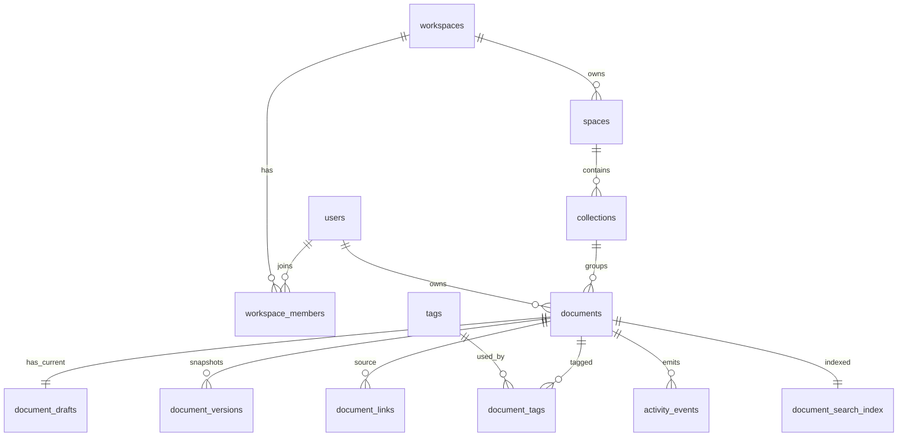

# Backend Data Model V1

本文档给 `Northstar Atlas Library` 第一版后端落库使用。结论基于当前目录、`apps/web/FRONTEND_API_CONTRACT.md`、Tiptap 富文本存储方式，以及常见知识库/协作文档产品的建模方式。

## 1. 项目结构评估

当前根目录:

```text
D:\editor
├─ apps
│  ├─ gateway
│  └─ web
├─ docs
├─ packages
└─ services
   ├─ api
   └─ file-service
```

这个方向是对的，适合后续演进成 monorepo:

- `apps/web`: 当前 React + Tiptap 前端，职责清晰。
- `services/api`: 建议作为主业务 API，承接 workspace、space、collection、document、tag、version、search、activity、permission 等核心能力。
- `services/file-service`: 预留给上传、对象存储签名、图片信息、缩略图、病毒扫描等文件能力。第一版可以先不单独启动服务，但表结构要预留文件域。
- `apps/gateway`: 只有在后续需要 BFF/API gateway、鉴权注入、聚合多个服务时才保留独立职责。第一版如果没有明确 gateway 需求，建议暂时不要同时实现 `gateway` 和 `services/api` 两套路由。
- `packages`: 后续放共享类型、API contract、DB schema、配置、lint/tsconfig。当前还空，属于合理预留。
- `docs`: 应该成为架构和协议的主位置。现有 `FRONTEND_API_CONTRACT.md` 在 `apps/web` 下，建议后续移动或复制到 `docs/api/FRONTEND_API_CONTRACT.md`，避免后端同学只看前端目录才知道接口。

建议补齐的根目录文件:

```text
D:\editor
├─ package.json              # 如果走 JS/TS monorepo
├─ pnpm-workspace.yaml       # 或 npm/yarn workspace 配置
├─ .gitignore
├─ .env.example
├─ README.md
└─ docs
   ├─ BACKEND_DATA_MODEL_V1.md
   └─ api
      └─ FRONTEND_API_CONTRACT.md
```

## 2. 建模原则

这个项目不是普通博客/CMS，而是多空间知识库 + 富文本编辑器。表结构应按以下主流原则设计:

1. 多租户优先: 所有业务表带 `workspace_id`，后续做权限、审计、分库、RLS 都不会返工。
2. 容器和文档分离: `workspace -> space -> collection -> document`，前端的 `folder` 在数据库里建议叫 `collection`，因为未来可能嵌套、归档、迁移和跨空间复用。
3. 文档元数据和正文分离: `documents` 存标题、状态、排序、owner、revision；`document_drafts` 存当前 Tiptap JSON 正文；`document_versions` 存不可变版本/发布快照。
4. 不把每次自动保存都写成完整版本: 自动保存只更新当前 draft 和 `documents.revision`；只有发布、手动快照、导入才写入 `document_versions`。
5. 富文本正文用 `jsonb`: Tiptap 官方建议持久化 JSON，比 HTML 更灵活、可解析、便于外部编辑。
6. 标签、引用、权限、文件、活动单独建表: 这些是知识库产品后续最容易膨胀的功能，不能塞到 `documents` 的 JSON 里。
7. 多人协作单独预留 Yjs 存储: 当前第一版 API 不做协作；以后做协作时用 `bytea` 存 Yjs update/state，不要和 Tiptap JSON draft 混在同一张表。
8. 搜索索引单独表: 第一版可以只搜标题，后续全文搜索或外部搜索引擎同步都更容易。

参考依据:

- Tiptap Persistence: https://tiptap.dev/docs/editor/core-concepts/persistence
- Yjs Document Updates: https://docs.yjs.dev/api/document-updates
- PostgreSQL JSON Types: https://www.postgresql.org/docs/current/datatype-json.html
- PostgreSQL Full Text Search Indexes: https://www.postgresql.org/docs/current/textsearch-indexes.html

## 3. 推荐核心 ER 关系



## 4. V1 必建表

第一版后端建议先落这些表，足够支撑现有 API 且不会卡住未来扩展:

| 模块 | 表 | 作用 |
| --- | --- | --- |
| 用户/租户 | `users` | 应用内用户档案。外部 Auth 也应映射一张本地用户表。 |
| 用户/租户 | `workspaces` | 顶层租户，例如 Northstar。 |
| 用户/租户 | `workspace_members` | workspace 成员和角色。 |
| 知识空间 | `spaces` | workspace 下的知识库空间，例如 Atlas Library。 |
| 知识空间 | `collections` | 文档集合/目录，可嵌套，映射前端 folder。 |
| 文档 | `documents` | 文档元数据、状态、排序、乐观锁 revision。 |
| 文档 | `document_drafts` | 当前可编辑正文，Tiptap JSONContent。 |
| 文档 | `document_versions` | 发布版本/手动快照/导入快照。 |
| 标签 | `tags` | workspace 级标签字典。 |
| 标签 | `document_tags` | 文档和标签多对多。 |
| 引用 | `document_links` | 显式 related documents、内部链接、backlinks。 |
| 活动 | `activity_events` | Activity tab、审计基础。 |
| 搜索 | `document_search_index` | 标题/正文搜索索引。 |

## 5. V1 PostgreSQL DDL 骨架

> 约定: 使用 PostgreSQL。ID 使用 UUID，推荐后端统一生成。如果后续极高写入量或强排序需求，可以改 UUIDv7/ULID，但接口仍保持 string。
>
> 生产迁移里建议把 `workspace_id` 纳入复合外键，例如 `(workspace_id, document_id) -> documents(workspace_id, id)`，防止跨 workspace 误关联。下面 DDL 为可读性保留了核心字段和主要约束，实际 migration 可以在此基础上补强复合 FK。

```sql
CREATE EXTENSION IF NOT EXISTS pgcrypto;
CREATE EXTENSION IF NOT EXISTS citext;

CREATE TABLE users (
  id uuid PRIMARY KEY DEFAULT gen_random_uuid(),
  email citext UNIQUE,
  display_name text NOT NULL,
  avatar_url text,
  external_provider text,
  external_subject text,
  created_at timestamptz NOT NULL DEFAULT now(),
  updated_at timestamptz NOT NULL DEFAULT now(),
  deleted_at timestamptz,
  UNIQUE (external_provider, external_subject)
);

CREATE TABLE workspaces (
  id uuid PRIMARY KEY DEFAULT gen_random_uuid(),
  name text NOT NULL,
  slug text NOT NULL UNIQUE,
  created_by uuid REFERENCES users(id),
  default_space_id uuid,
  created_at timestamptz NOT NULL DEFAULT now(),
  updated_at timestamptz NOT NULL DEFAULT now(),
  deleted_at timestamptz
);

CREATE TABLE workspace_members (
  workspace_id uuid NOT NULL REFERENCES workspaces(id) ON DELETE CASCADE,
  user_id uuid NOT NULL REFERENCES users(id) ON DELETE CASCADE,
  role text NOT NULL CHECK (role IN ('owner', 'admin', 'editor', 'viewer')),
  status text NOT NULL DEFAULT 'active' CHECK (status IN ('invited', 'active', 'suspended')),
  joined_at timestamptz,
  created_at timestamptz NOT NULL DEFAULT now(),
  PRIMARY KEY (workspace_id, user_id)
);

CREATE TABLE spaces (
  id uuid PRIMARY KEY DEFAULT gen_random_uuid(),
  workspace_id uuid NOT NULL REFERENCES workspaces(id) ON DELETE CASCADE,
  name text NOT NULL,
  slug text NOT NULL,
  description text,
  visibility text NOT NULL DEFAULT 'workspace' CHECK (visibility IN ('private', 'workspace', 'public')),
  sort_order numeric(20, 10) NOT NULL DEFAULT 0,
  created_by uuid REFERENCES users(id),
  created_at timestamptz NOT NULL DEFAULT now(),
  updated_at timestamptz NOT NULL DEFAULT now(),
  archived_at timestamptz,
  deleted_at timestamptz,
  UNIQUE (workspace_id, slug)
);

ALTER TABLE workspaces
  ADD CONSTRAINT workspaces_default_space_fk
  FOREIGN KEY (default_space_id) REFERENCES spaces(id) ON DELETE SET NULL;

CREATE TABLE collections (
  id uuid PRIMARY KEY DEFAULT gen_random_uuid(),
  workspace_id uuid NOT NULL REFERENCES workspaces(id) ON DELETE CASCADE,
  space_id uuid NOT NULL REFERENCES spaces(id) ON DELETE CASCADE,
  parent_collection_id uuid REFERENCES collections(id) ON DELETE SET NULL,
  title text NOT NULL,
  slug text,
  sort_order numeric(20, 10) NOT NULL DEFAULT 0,
  created_by uuid REFERENCES users(id),
  created_at timestamptz NOT NULL DEFAULT now(),
  updated_at timestamptz NOT NULL DEFAULT now(),
  archived_at timestamptz,
  deleted_at timestamptz
);

CREATE INDEX collections_space_order_idx
  ON collections (workspace_id, space_id, parent_collection_id, sort_order);

CREATE TABLE documents (
  id uuid PRIMARY KEY DEFAULT gen_random_uuid(),
  workspace_id uuid NOT NULL REFERENCES workspaces(id) ON DELETE CASCADE,
  space_id uuid NOT NULL REFERENCES spaces(id) ON DELETE CASCADE,
  collection_id uuid REFERENCES collections(id) ON DELETE SET NULL,
  owner_id uuid REFERENCES users(id),
  title text NOT NULL,
  slug text,
  status text NOT NULL DEFAULT 'draft' CHECK (status IN ('draft', 'published', 'archived')),
  sort_order numeric(20, 10) NOT NULL DEFAULT 0,
  revision bigint NOT NULL DEFAULT 0 CHECK (revision >= 0),
  current_published_version_id uuid,
  last_edited_by uuid REFERENCES users(id),
  created_by uuid REFERENCES users(id),
  created_at timestamptz NOT NULL DEFAULT now(),
  updated_at timestamptz NOT NULL DEFAULT now(),
  published_at timestamptz,
  archived_at timestamptz,
  deleted_at timestamptz
);

CREATE INDEX documents_collection_order_idx
  ON documents (workspace_id, space_id, collection_id, sort_order)
  WHERE deleted_at IS NULL;

CREATE INDEX documents_updated_idx
  ON documents (workspace_id, updated_at DESC)
  WHERE deleted_at IS NULL;

CREATE TABLE document_drafts (
  document_id uuid PRIMARY KEY REFERENCES documents(id) ON DELETE CASCADE,
  workspace_id uuid NOT NULL REFERENCES workspaces(id) ON DELETE CASCADE,
  content jsonb NOT NULL,
  text_content text NOT NULL DEFAULT '',
  outline jsonb NOT NULL DEFAULT '[]'::jsonb,
  word_count integer NOT NULL DEFAULT 0 CHECK (word_count >= 0),
  content_hash text,
  updated_by uuid REFERENCES users(id),
  updated_at timestamptz NOT NULL DEFAULT now()
);

CREATE INDEX document_drafts_workspace_idx
  ON document_drafts (workspace_id, updated_at DESC);

CREATE TABLE document_versions (
  id uuid PRIMARY KEY DEFAULT gen_random_uuid(),
  workspace_id uuid NOT NULL REFERENCES workspaces(id) ON DELETE CASCADE,
  document_id uuid NOT NULL REFERENCES documents(id) ON DELETE CASCADE,
  version_no integer NOT NULL,
  label text NOT NULL,
  version_type text NOT NULL DEFAULT 'manual'
    CHECK (version_type IN ('manual', 'published', 'imported', 'system')),
  content jsonb NOT NULL,
  text_content text NOT NULL DEFAULT '',
  outline jsonb NOT NULL DEFAULT '[]'::jsonb,
  word_count integer NOT NULL DEFAULT 0 CHECK (word_count >= 0),
  created_by uuid REFERENCES users(id),
  created_at timestamptz NOT NULL DEFAULT now(),
  published_at timestamptz,
  UNIQUE (document_id, version_no),
  UNIQUE (document_id, label)
);

ALTER TABLE documents
  ADD CONSTRAINT documents_current_published_version_fk
  FOREIGN KEY (current_published_version_id) REFERENCES document_versions(id);

CREATE INDEX document_versions_doc_idx
  ON document_versions (workspace_id, document_id, version_no DESC);

CREATE TABLE tags (
  id uuid PRIMARY KEY DEFAULT gen_random_uuid(),
  workspace_id uuid NOT NULL REFERENCES workspaces(id) ON DELETE CASCADE,
  name text NOT NULL,
  slug text NOT NULL,
  color text,
  created_by uuid REFERENCES users(id),
  created_at timestamptz NOT NULL DEFAULT now(),
  updated_at timestamptz NOT NULL DEFAULT now(),
  deleted_at timestamptz,
  UNIQUE (workspace_id, slug)
);

CREATE TABLE document_tags (
  workspace_id uuid NOT NULL REFERENCES workspaces(id) ON DELETE CASCADE,
  document_id uuid NOT NULL REFERENCES documents(id) ON DELETE CASCADE,
  tag_id uuid NOT NULL REFERENCES tags(id) ON DELETE CASCADE,
  created_at timestamptz NOT NULL DEFAULT now(),
  PRIMARY KEY (document_id, tag_id)
);

CREATE INDEX document_tags_tag_idx
  ON document_tags (workspace_id, tag_id);

CREATE TABLE document_links (
  id uuid PRIMARY KEY DEFAULT gen_random_uuid(),
  workspace_id uuid NOT NULL REFERENCES workspaces(id) ON DELETE CASCADE,
  source_document_id uuid NOT NULL REFERENCES documents(id) ON DELETE CASCADE,
  target_document_id uuid REFERENCES documents(id) ON DELETE CASCADE,
  target_url text,
  link_type text NOT NULL DEFAULT 'reference'
    CHECK (link_type IN ('reference', 'related', 'embed', 'external')),
  anchor_text text,
  source_anchor jsonb,
  target_anchor jsonb,
  created_by uuid REFERENCES users(id),
  created_at timestamptz NOT NULL DEFAULT now(),
  CHECK (target_document_id IS NOT NULL OR target_url IS NOT NULL)
);

CREATE INDEX document_links_source_idx
  ON document_links (workspace_id, source_document_id, link_type);

CREATE INDEX document_links_target_idx
  ON document_links (workspace_id, target_document_id)
  WHERE target_document_id IS NOT NULL;

CREATE TABLE activity_events (
  id uuid PRIMARY KEY DEFAULT gen_random_uuid(),
  workspace_id uuid NOT NULL REFERENCES workspaces(id) ON DELETE CASCADE,
  actor_id uuid REFERENCES users(id),
  entity_type text NOT NULL,
  entity_id uuid NOT NULL,
  action text NOT NULL,
  summary text NOT NULL,
  metadata jsonb NOT NULL DEFAULT '{}'::jsonb,
  created_at timestamptz NOT NULL DEFAULT now()
);

CREATE INDEX activity_events_entity_idx
  ON activity_events (workspace_id, entity_type, entity_id, created_at DESC);

CREATE INDEX activity_events_actor_idx
  ON activity_events (workspace_id, actor_id, created_at DESC);

CREATE TABLE document_search_index (
  document_id uuid PRIMARY KEY REFERENCES documents(id) ON DELETE CASCADE,
  workspace_id uuid NOT NULL REFERENCES workspaces(id) ON DELETE CASCADE,
  space_id uuid NOT NULL REFERENCES spaces(id) ON DELETE CASCADE,
  title text NOT NULL,
  text_content text NOT NULL DEFAULT '',
  search_vector tsvector NOT NULL,
  updated_at timestamptz NOT NULL DEFAULT now()
);

CREATE INDEX document_search_workspace_idx
  ON document_search_index (workspace_id, space_id);

CREATE INDEX document_search_vector_idx
  ON document_search_index USING GIN (search_vector);
```

## 6. 第一版接口如何映射

### `GET /bootstrap`

读取:

- `workspaces`
- `spaces`
- `collections`
- `documents`
- `document_tags + tags`

返回 `folders` 时:

- `collections.title -> KnowledgeFolder.title`
- `collections.sort_order -> KnowledgeFolder.sortOrder`
- `COUNT(documents.id) -> KnowledgeFolder.documentCount`

返回 `documents` 时:

- `documents.collection_id -> folderId`
- `documents.status`
- `documents.updated_at`
- `document_tags/tags -> tags`
- `documents.sort_order -> sortOrder`

### `GET /documents/:documentId`

读取:

- `documents`
- `document_drafts`
- `users` owner
- `document_tags + tags`
- `document_versions` 当前发布版本或最新版本 label

返回:

- `document_drafts.content -> content`
- `documents.revision -> revision`
- `documents.owner_id -> owner`
- `document_versions.label -> version`

### `PATCH /documents/:documentId`

事务内完成:

1. `SELECT documents.revision FOR UPDATE`
2. 校验 `baseRevision == documents.revision`
3. 更新 `documents.title/status/updated_at/last_edited_by`
4. 更新 `document_drafts.content/text_content/outline/word_count/content_hash`
5. 重建 `document_tags`
6. `documents.revision = documents.revision + 1`
7. 写 `activity_events`
8. 同步或异步更新 `document_search_index`

冲突:

- 如果 `baseRevision < documents.revision`，返回 `409 CONFLICT`
- 第一版不做 merge，前端刷新即可

### `GET /documents/:documentId/context`

读取:

- `document_links WHERE source_document_id = :id AND link_type = 'related'`
- `document_links WHERE target_document_id = :id` 作为 backlinks
- `document_versions WHERE document_id = :id ORDER BY version_no DESC`

### `GET /documents/:documentId/activity`

读取:

- `activity_events WHERE entity_type = 'document' AND entity_id = :documentId`

### `GET /search`

第一版:

- 只搜 `documents.title ILIKE ...` 或 `document_search_index.title`

后续:

- 使用 `document_search_index.search_vector @@ websearch_to_tsquery(...)`
- 中文内容较多时，PostgreSQL 默认分词不够，应接入 Meilisearch/OpenSearch/Elasticsearch 或 PostgreSQL 中文分词扩展；表结构仍然可以作为外部索引同步源

## 7. V2 扩展表, 先预留设计

这些表第一版可以不实现，但不要把相关字段塞进 `documents.content` 里。

### 文件/附件

```sql
CREATE TABLE files (
  id uuid PRIMARY KEY DEFAULT gen_random_uuid(),
  workspace_id uuid NOT NULL REFERENCES workspaces(id) ON DELETE CASCADE,
  uploaded_by uuid REFERENCES users(id),
  storage_provider text NOT NULL,
  bucket text NOT NULL,
  object_key text NOT NULL,
  original_filename text NOT NULL,
  mime_type text NOT NULL,
  byte_size bigint NOT NULL CHECK (byte_size >= 0),
  checksum_sha256 text,
  width integer,
  height integer,
  metadata jsonb NOT NULL DEFAULT '{}'::jsonb,
  created_at timestamptz NOT NULL DEFAULT now(),
  deleted_at timestamptz,
  UNIQUE (storage_provider, bucket, object_key)
);

CREATE TABLE document_attachments (
  id uuid PRIMARY KEY DEFAULT gen_random_uuid(),
  workspace_id uuid NOT NULL REFERENCES workspaces(id) ON DELETE CASCADE,
  document_id uuid NOT NULL REFERENCES documents(id) ON DELETE CASCADE,
  file_id uuid NOT NULL REFERENCES files(id) ON DELETE RESTRICT,
  relation_type text NOT NULL DEFAULT 'attachment'
    CHECK (relation_type IN ('attachment', 'inline_image', 'cover')),
  metadata jsonb NOT NULL DEFAULT '{}'::jsonb,
  created_by uuid REFERENCES users(id),
  created_at timestamptz NOT NULL DEFAULT now()
);
```

旧 Go 文件服务 `E:\ClayMo\services\file-service` 中有一条值得保留的设计原则: 上传过程的唯一事实源是 upload session，`files` 只在 finalize 后创建。新后端不迁移 go-zero 实现，但建议保留这个流程。

```sql
CREATE TABLE upload_sessions (
  id uuid PRIMARY KEY DEFAULT gen_random_uuid(),
  workspace_id uuid NOT NULL REFERENCES workspaces(id) ON DELETE CASCADE,
  owner_id uuid REFERENCES users(id),
  idempotency_key text NOT NULL,
  original_filename text NOT NULL,
  mime_type text NOT NULL,
  byte_size bigint NOT NULL CHECK (byte_size >= 0),
  checksum_sha256 text,
  biz_type text,
  storage_provider text NOT NULL,
  bucket text NOT NULL,
  object_key text NOT NULL,
  upload_mode text NOT NULL CHECK (upload_mode IN ('single', 'multipart')),
  multipart_upload_id text,
  chunk_size bigint,
  total_parts integer,
  status text NOT NULL DEFAULT 'initiated'
    CHECK (status IN ('initiated', 'uploading', 'completed', 'aborted', 'expired', 'failed', 'finalized')),
  finalized_file_id uuid REFERENCES files(id),
  expires_at timestamptz NOT NULL,
  finalized_at timestamptz,
  created_at timestamptz NOT NULL DEFAULT now(),
  updated_at timestamptz NOT NULL DEFAULT now(),
  UNIQUE (workspace_id, idempotency_key),
  UNIQUE (storage_provider, bucket, object_key)
);

CREATE INDEX upload_sessions_owner_idx
  ON upload_sessions (workspace_id, owner_id, created_at DESC);

CREATE INDEX upload_sessions_status_expires_idx
  ON upload_sessions (status, expires_at);

CREATE TABLE file_outbox_events (
  id uuid PRIMARY KEY DEFAULT gen_random_uuid(),
  workspace_id uuid NOT NULL REFERENCES workspaces(id) ON DELETE CASCADE,
  aggregate_type text NOT NULL,
  aggregate_id uuid NOT NULL,
  event_type text NOT NULL,
  payload jsonb NOT NULL,
  headers jsonb NOT NULL DEFAULT '{}'::jsonb,
  status text NOT NULL DEFAULT 'pending' CHECK (status IN ('pending', 'published', 'failed')),
  retry_count integer NOT NULL DEFAULT 0 CHECK (retry_count >= 0),
  next_retry_at timestamptz NOT NULL DEFAULT now(),
  last_error text,
  created_at timestamptz NOT NULL DEFAULT now(),
  updated_at timestamptz NOT NULL DEFAULT now()
);

CREATE INDEX file_outbox_events_dispatch_idx
  ON file_outbox_events (status, next_retry_at, created_at);

CREATE INDEX file_outbox_events_aggregate_idx
  ON file_outbox_events (workspace_id, aggregate_type, aggregate_id);
```

### 评论

```sql
CREATE TABLE comment_threads (
  id uuid PRIMARY KEY DEFAULT gen_random_uuid(),
  workspace_id uuid NOT NULL REFERENCES workspaces(id) ON DELETE CASCADE,
  document_id uuid NOT NULL REFERENCES documents(id) ON DELETE CASCADE,
  anchor jsonb,
  status text NOT NULL DEFAULT 'open' CHECK (status IN ('open', 'resolved')),
  created_by uuid REFERENCES users(id),
  resolved_by uuid REFERENCES users(id),
  created_at timestamptz NOT NULL DEFAULT now(),
  updated_at timestamptz NOT NULL DEFAULT now(),
  resolved_at timestamptz
);

CREATE TABLE comments (
  id uuid PRIMARY KEY DEFAULT gen_random_uuid(),
  workspace_id uuid NOT NULL REFERENCES workspaces(id) ON DELETE CASCADE,
  thread_id uuid NOT NULL REFERENCES comment_threads(id) ON DELETE CASCADE,
  author_id uuid REFERENCES users(id),
  body jsonb NOT NULL,
  body_text text NOT NULL DEFAULT '',
  created_at timestamptz NOT NULL DEFAULT now(),
  updated_at timestamptz NOT NULL DEFAULT now(),
  edited_at timestamptz,
  deleted_at timestamptz
);
```

评论 `anchor` 建议存稳定 block/node id，而不是只存 ProseMirror position。后续应在 Tiptap 中启用稳定节点 ID，否则段落移动后评论锚点会漂移。

### 权限 ACL

```sql
CREATE TABLE groups (
  id uuid PRIMARY KEY DEFAULT gen_random_uuid(),
  workspace_id uuid NOT NULL REFERENCES workspaces(id) ON DELETE CASCADE,
  name text NOT NULL,
  created_at timestamptz NOT NULL DEFAULT now(),
  UNIQUE (workspace_id, name)
);

CREATE TABLE group_members (
  group_id uuid NOT NULL REFERENCES groups(id) ON DELETE CASCADE,
  user_id uuid NOT NULL REFERENCES users(id) ON DELETE CASCADE,
  created_at timestamptz NOT NULL DEFAULT now(),
  PRIMARY KEY (group_id, user_id)
);

CREATE TABLE resource_permissions (
  id uuid PRIMARY KEY DEFAULT gen_random_uuid(),
  workspace_id uuid NOT NULL REFERENCES workspaces(id) ON DELETE CASCADE,
  resource_type text NOT NULL CHECK (resource_type IN ('space', 'collection', 'document')),
  resource_id uuid NOT NULL,
  grantee_type text NOT NULL CHECK (grantee_type IN ('user', 'group', 'workspace')),
  grantee_id uuid NOT NULL,
  permission text NOT NULL CHECK (permission IN ('viewer', 'commenter', 'editor', 'owner')),
  created_by uuid REFERENCES users(id),
  created_at timestamptz NOT NULL DEFAULT now(),
  UNIQUE (workspace_id, resource_type, resource_id, grantee_type, grantee_id)
);
```

第一版可以只用 `workspace_members.role`。等需要单文档分享、只读链接、私有空间时再启用 ACL。

### Yjs 多人协作

```sql
CREATE TABLE document_collaboration_states (
  document_id uuid PRIMARY KEY REFERENCES documents(id) ON DELETE CASCADE,
  workspace_id uuid NOT NULL REFERENCES workspaces(id) ON DELETE CASCADE,
  yjs_state bytea NOT NULL,
  yjs_state_vector bytea,
  compacted_until_update_id bigint,
  updated_at timestamptz NOT NULL DEFAULT now()
);

CREATE TABLE document_collaboration_updates (
  id bigserial PRIMARY KEY,
  workspace_id uuid NOT NULL REFERENCES workspaces(id) ON DELETE CASCADE,
  document_id uuid NOT NULL REFERENCES documents(id) ON DELETE CASCADE,
  actor_id uuid REFERENCES users(id),
  update_payload bytea NOT NULL,
  created_at timestamptz NOT NULL DEFAULT now()
);

CREATE INDEX document_collaboration_updates_doc_idx
  ON document_collaboration_updates (workspace_id, document_id, id);
```

协作实现要点:

- Presence/光标状态放 Redis/WebSocket 内存态，不建议落主数据库。
- Yjs update 是二进制增量，适合 `bytea`；定期 merge/compact 到 `document_collaboration_states`。
- 协作状态和 `document_drafts.content` 要有同步策略: 要么协作模式以 Yjs 为源，再异步导出 Tiptap JSON；要么非协作模式只使用 JSON draft。不要两个都当实时写入源。

### AI 任务

```sql
CREATE TABLE ai_jobs (
  id uuid PRIMARY KEY DEFAULT gen_random_uuid(),
  workspace_id uuid NOT NULL REFERENCES workspaces(id) ON DELETE CASCADE,
  document_id uuid REFERENCES documents(id) ON DELETE CASCADE,
  requested_by uuid REFERENCES users(id),
  action text NOT NULL,
  input_revision bigint,
  status text NOT NULL DEFAULT 'queued'
    CHECK (status IN ('queued', 'running', 'succeeded', 'failed', 'cancelled')),
  result jsonb,
  error_message text,
  created_at timestamptz NOT NULL DEFAULT now(),
  updated_at timestamptz NOT NULL DEFAULT now()
);
```

## 8. 几个关键取舍

### `revision` 和 `version` 必须分开

- `documents.revision`: 自动保存乐观锁，只用于冲突检测，单调递增。
- `document_versions.label`: 给用户看的版本，例如 `3.2`。
- `document_versions.version_no`: 数据库内部整数顺序，便于排序和约束。

这三个如果混用，后续发布流和自动保存会很容易返工。

### 不建议第一版建 `document_blocks`

Tiptap/ProseMirror 本质是树状文档，直接关系型拆 block 会让列表、表格、引用、代码块、嵌套结构都变复杂。主流做法是:

1. 原文存 `document_drafts.content jsonb`
2. 需要搜索/目录/链接/评论时，从 JSON 中抽取派生数据到独立表
3. 如果要评论锚点或块级引用，先在 Tiptap 节点里加稳定 `nodeId`

### `collections` 不叫 `folders`

前端可以继续叫 folder。数据库建议叫 collection，因为后续可能承载:

- 嵌套目录
- 跨空间迁移
- 权限继承
- 归档
- 排序
- 统计

`folder` 语义太窄，后续改名成本高。

### Tags 不用 `text[]`

API 可以返回 `tags: string[]`，但数据库应使用 `tags + document_tags`。原因:

- 可以统一大小写和 slug
- 可以重命名标签
- 可以统计热门标签
- 可以给标签加颜色、描述、权限或归档

### Search 第一版不要过度建设

第一版可以数据库内标题搜索。全文搜索建议先准备 `document_search_index`，实际策略按语言和规模选:

- 英文/低规模: PostgreSQL `tsvector + GIN`
- 中文/中高规模: 外部搜索引擎或中文分词扩展
- 需要语义搜索: 另建 embedding 表或向量库，不替代精确搜索表

## 9. 建议实施顺序

1. 先在 `services/api` 建迁移体系和上述 V1 必建表。
2. 写 seed 数据: 一个 workspace、一个 space、当前 7 个 collections、当前 mock documents。
3. 实现 `/bootstrap`、`GET /documents/:id`、`PATCH /documents/:id`。
4. 接入 `revision` 冲突检测。
5. 再实现 tags、links、activity、search。
6. 文件、评论、ACL、协作不要塞进第一版接口，但表边界按本文档保留。
